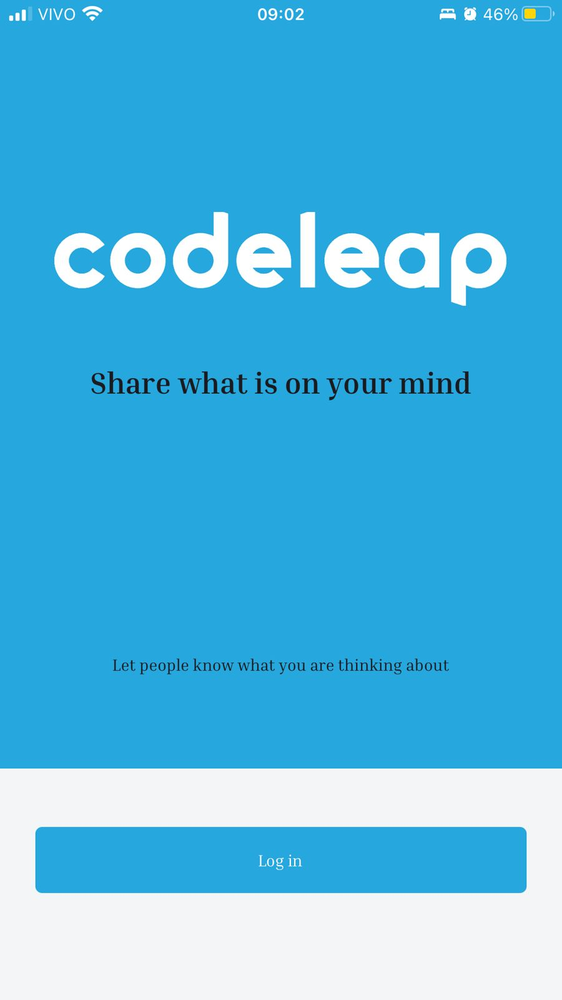
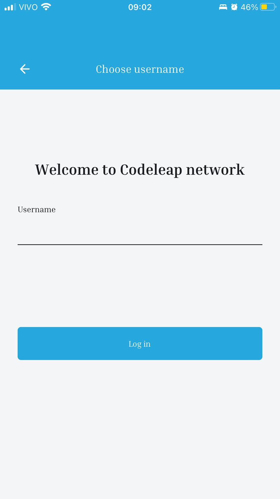
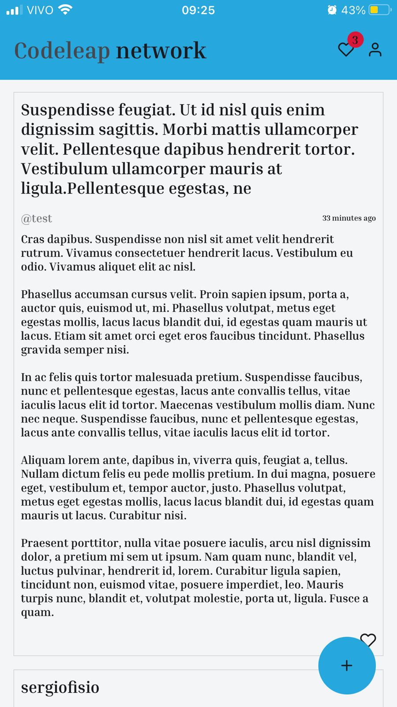
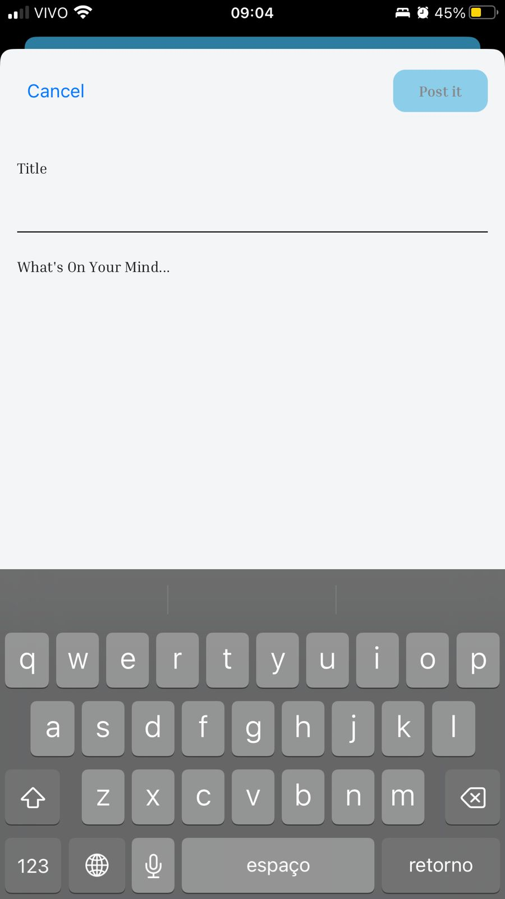
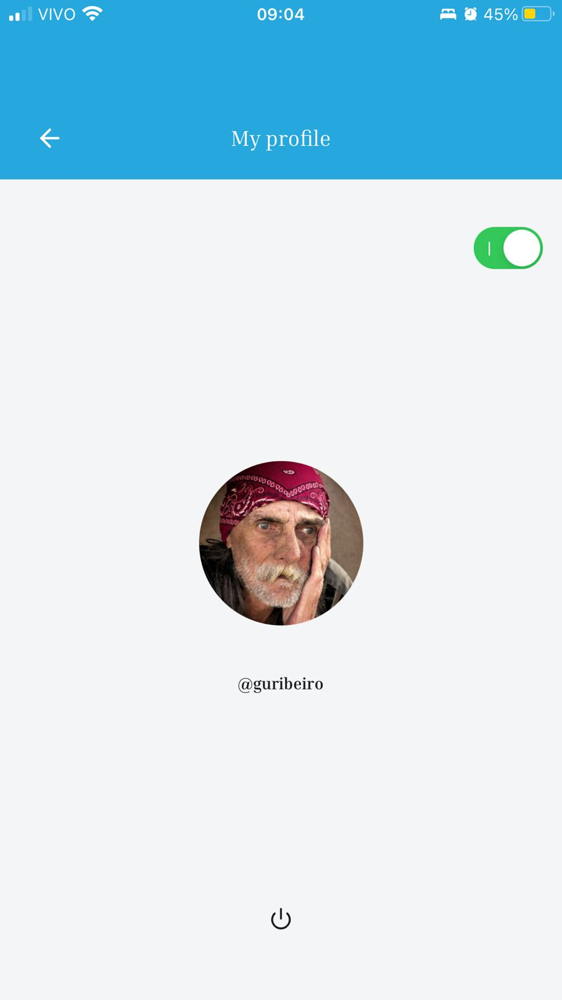

<div align="center" id="top"> 
  

  &#xa0;
</div>

<h1 align="center">Codeleap network</h1>

<br/>

<p align="center">
  
  
  
  
  
</p>

 
<br/>

## 🏹 About ##
Explore your feed and create posts about what you're thinking about

## 🎆 Features ##

🚩 Authentication\
🚩 List posts\
🚩 Create posts\
🚩 Update your own posts\
🚩 Delete your own posts\
🚩 Light and Dark theme\
🚩 Update avatar

## 🚀 Technologies ##

The following tools were used in this project:

- [Expo](https://expo.io/)
- [Node.js](https://nodejs.org/en/)
- [React](https://pt-br.reactjs.org/)
- [React Native](https://reactnative.dev/)
- [TypeScript](https://www.typescriptlang.org/)

## :white_check_mark: Requirements ##

Before starting :checkered_flag:, you need to have [Git](https://git-scm.com) and [Node](https://nodejs.org/en/) installed.

## :checkered_flag: Starting ##

```bash
# Clone this project
$ git clone https://github.com/guribeiro/codeleap-mobile

# Access
$ cd codeleap-mobile

# Install dependencies
$ yarn

# Run the project
$ npx expo start
```

The app will starts on the expo go app or you can emulate it o your phone ou Android studio

## :memo: License ##

This project is under license from MIT. For more details, see the [LICENSE](LICENSE.md) file.


Made with 💜 by <a href="https://github.com/guribeiro" target="_blank">Gustavo Henrique Ribeiro Dias</a>

&#xa0;

<a href="#top">Back to top</a>
